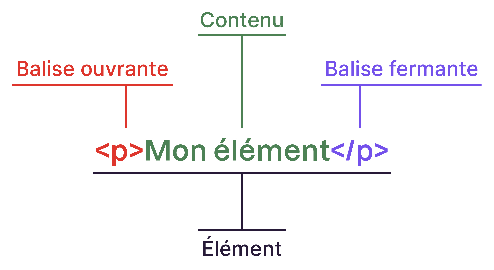
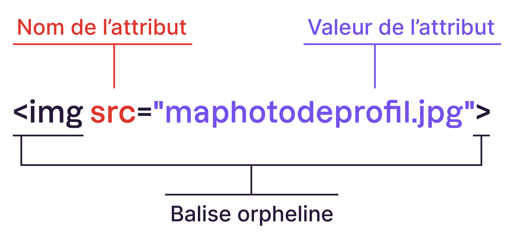
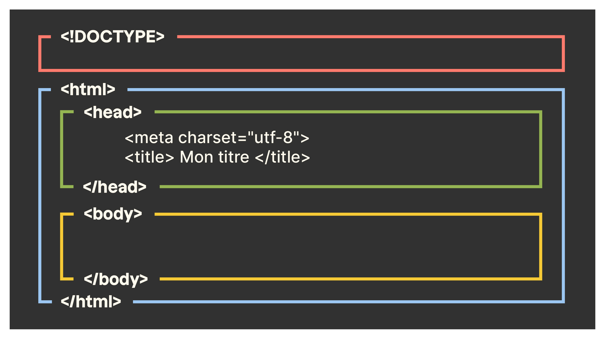

## HTML ET CSS : cours 1

#### 1. Introduction au HTML
- **Concepts de base** :
  - Qu'est-ce que HTML ? HyperText Markup Language, un langage de balisage. les balises sont entre chevrons `<p> paragraphe </p>`. Il sert à formater le texte des pages web : titre, sous-titres, paragraphe, listes, tableaux, liens, images, vidéo,... Hypertext signifie entres autres du texte avec des liens que l’on peut cliquer. (remarque web = toile, net = filet, network = réseau)
  
| élément | balise orpheline | structure d’une page html |
|-------|------|------|
| |  |  |
  
- **Balises HTML courantes** :
      - `<html>`, `<head>`, `<title>`, `<body>`
      - Titres : `<h1>` à `<h6>` (h comme heading = titre)
      - Paragraphes : `<p>` (p comme paragraphe)
      - Liens : `<a href="URL">Texte du lien</a>` (a comme ancre)
      - Images : `` (chemin = url = uniform ressource locators)
      - Listes : `<ul>`, `<ol>`, `<li>` (unordered list, ordered list, list item)

- **Exemple 1** :
      - Créer un dossier `page web` dans votre dossier élève
      - Créer un fichier `index.html` dans Notepad++ et écrire le code ci-dessous :
      - puis sauver le fichier dans votre dossier `page web`.
      - télécharger une image et la mettre dans le dossier `page web` et la renommer voyage.jpg
      - exécuter index.html avec un navigateur. 

    ```html
    <!DOCTYPE html>
    <html lang="fr">
    <head>
        <meta charset= "UTF-8">
        <title>Ma Première Page Web</title>
    </head>
    <body>
        <h1>Bienvenue sur ma page web</h1>
        <p>Ceci est un paragraphe sur ma première page web.</p>
        <a href="http://www.google.com"> ma page préférée</a>
        <h2>Mes loisirs</h2>
        <ul>
            <li>Lecture</li>
            <li>Sport</li>
            <li>Voyages</li>
        </ul>
        
    </body>
    </html>
    ```


#### 2. Introduction au CSS
- **Concepts de base** :
      - Qu’est-ce que CSS ? {cascading style sheet) défini le style de la page (couleur, police, taille, centré, espacement, marge,...)
      - Comment CSS stylise le HTML : en définissant le style des titres, des paragraphes,...
      - il peut être inclus dans la page web ou dans un fichier à part .css. Il est entre les balises `<style>`.

- **Syntaxe CSS** :
      - Sélecteurs, propriétés et valeurs.
      - Exemples de propriétés courantes : `color`, `background-color`, `font-size`, `text-align`.

- **Exemple 2** :
      - Entre les balises `<style>` insérer le code suivant dans le `<head>` du fichier indx.html. 

    ```css
    body {
        background-color: lightgrey;
        font-family: Arial, sans-serif;
    }

    h1 {
        color: navy;
        text-align: center;
    }

    p {
        font-size: 16px;
        line-height: 1.5;
    }

    ul {
        list-style-type: square;
    }
    ```

- **Lien entre HTML et CSS** :
      - le css est en général placé dans un fichier à part.
      - Créer un fichier `style.css` et couper coller le code ci-dessus.
      - supprimer les balises `<style>`
      - Sauver le fichier dans le dossier `page web`.
      - Ajouter la ligne suivante dans le `<head>` de `index.html` :
    ```html
    <link rel="stylesheet" href="style.css">
    ```

#### 3. Application
- **Créer une page web personnelle** :
      - Créer une page web personnelle en utilisant HTML et CSS. La page doit inclure :
        - Un titre principal.
        - Un paragraphe de présentation.
        - Une liste de ses activités.
        - Une image représentant des hobbies (par exemple, une image d'un livre, d'un sport, etc.).
<br>
<br>
- **Exemple de structure de page web** :
  
    ```html
    <!DOCTYPE html>
    <html lang="fr">
    <head>
        <meta charset="UTF-8">
        <meta name="viewport" content="width=device-width, initial-scale=1.0">
        <title>Mon Profil</title>
        <link rel="stylesheet" href="style.css">
    </head>
    <body>
        <header>
            <h1>Mon Nom</h1>
            <p>Bonjour ! Je suis un étudiant passionné par la technologie.</p>
        </header>
        <main>
            <h2>Mes Loisirs</h2>
            <ul>
                <li>Programmation</li>
                <li>Musique</li>
                <li>Cuisine</li>
            </ul>
            
        </main>
        <footer>
            <p>&copy; 2024 Mon Nom. Tous droits réservés.</p>
        </footer>
    </body>
    </html>
    ```
#### 4. Conclusion
- **Révision des concepts clés** :
      - Importance de HTML et CSS.
      - Comment ces technologies se complètent pour créer des pages web.
